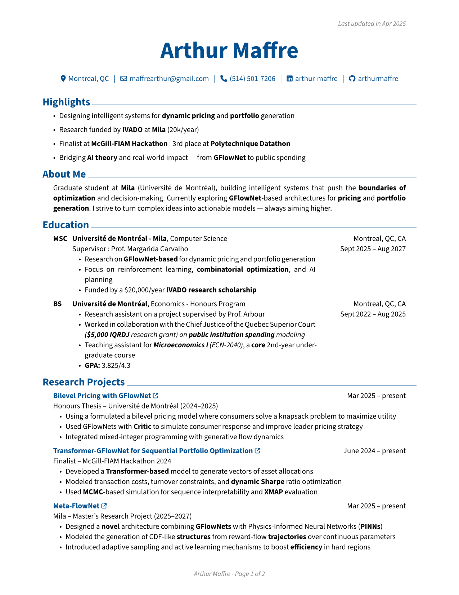
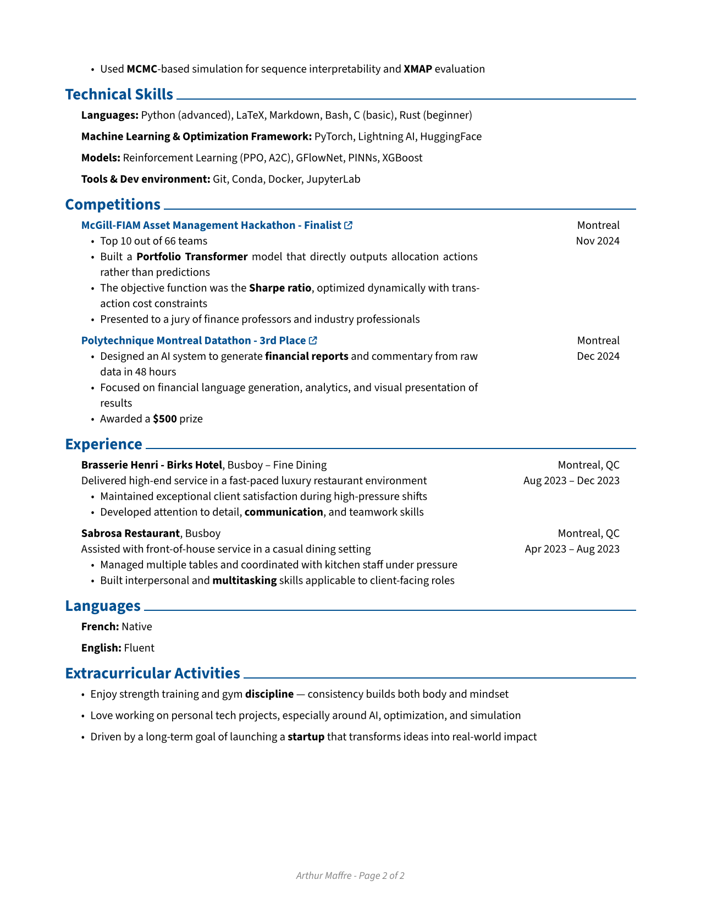

## 📄 CV Preview

[](rendercv_output/Arthur_Maffre_CV.pdf)

[](rendercv_output/Arthur_Maffre_CV.pdf)

# ⚙️ CV Management

🚀 Access the full PDF:
- 🇬🇧 [Download CV (English)](https://github.com/arthurmaffre/CV/blob/ebe76cc0a3cb120a15b570645b7875cc779b1d8d/rendercv_output/Arthur_Maffre_CV.pdf)
- 🇫🇷 [Download CV (French)](https://github.com/arthurmaffre/CV/blob/ebe76cc0a3cb120a15b570645b7875cc779b1d8d/rendercv_output/Arthur_Maffre_(FR)_CV.pdf)

---

This repository contains the YAML files used to automatically generate my CVs (both **French** and **English** versions) using the **RenderCV** typographic engine.

---

## 🐍 Load the Conda Environment

Before running any commands, make sure the environment is active:

```bash
conda activate CV
```

Or create it from scratch:

```bash
conda env create -f environnement.yaml
conda activate CV
```

---

## 🔍 Preview and Render the CV

To generate the PDF version of your CV:

```bash
rendercv render "Arthur_Maffre_CV.yaml"
```

This will create the `rendercv_output/` folder with:

- `Arthur_Maffre_CV.pdf` – PDF format
- `Arthur_Maffre_CV.typ` – Typst source code
- `Arthur_Maffre_CV.md` – Markdown version
- `Arthur_Maffre_CV.html` – HTML version (can be checked with Grammarly)
- `Arthur_Maffre_CV_1.png`, etc. – PNG images of each page

---

## ✏️ Editing the CV

1. Open either `Arthur_Maffre_CV.yaml` or `Arthur_Maffre_FR_CV.yaml` in your editor (e.g., VS Code).
2. Edit the appropriate sections (e.g., `Highlights`, `Education`, `Research Projects`, etc.).
3. Save the file.

---

## 🚀 Live rendering (auto-refresh)

You can use the `--watch` mode to render the CV automatically when the file is saved:

```bash
rendercv render --watch "Arthur_Maffre_CV.yaml"
```

Or:

```bash
rendercv render --watch "Arthur_Maffre_FR_CV.yaml"
```

---

## 📂 Recommended Project Structure

```
CV/
├── classic/
├── markdown/
├── rendercv_output/
│   ├── Arthur_Maffre_CV.pdf
│   ├── Arthur_Maffre_(FR)_CV.pdf
│   └── ...
├── Arthur_Maffre_CV.yaml
├── Arthur_Maffre_FR_CV.yaml
├── environnement.yaml
└── README.md
```

---

**🧠 Tip:** Use the HTML version (`.html`) if you want to spellcheck or proofread with tools like **Grammarly**.
